# Rapport n°1 P4x

## TP1

**1) Ajouter plusieurs Mesh simples comme des cubes (BoxGeometry) ou des sphères (SphereGeometry) avec un matériau coloré basique (MeshBasicMaterial).**

Dans le fichier *scene.js* on créer une instance de Mesh.
Le constructeur demande une taille (largeur, hauteur, profondeur) ainsi qu'un matériau.  

    var box1 = new THREE.Mesh(
        new THREE.BoxGeometry(2,2,2),
        new THREE.MeshBasicMaterial( { color: "#FF8F77" })
    );
Puis on définit la position de notre Mesh sous la forme *(x,y,z).

    box1.position.set(5,5,5); //origine du cube
  
Enfin on ajoute notre Mesh à la scène.

    scene.add(box1);

Le résultat obtenu est le suivant :  
  

De même on rajoute ensuite d'autres Mesh à notre scène qui ressemble alors à ça :
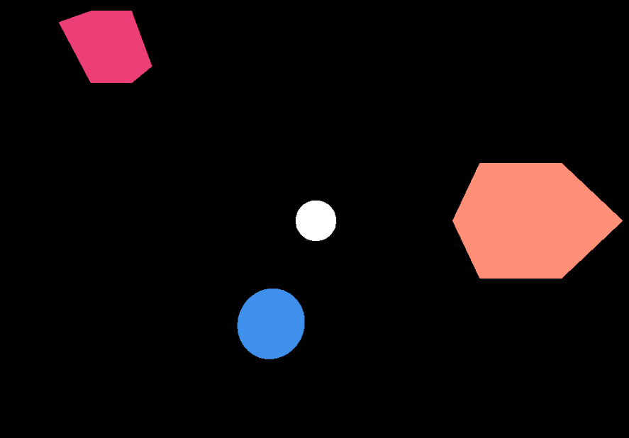

&nbsp;

**2) Changer le matériau utilisé pour les objets pour un MeshLambertMaterial. Que constate-t-on ?**  

Dans le constructeur de nos Mesh on remplace la ligne correspondant au matériel par :

    new THREE.MeshLambertMaterial( { color: "#FFFFFF" })

Nos Mesh ne sont alors plus visibles car les *meshLambertMaterial* ont besoin d'une source de lumière.

On peut tout de même les "voir" en donnant au fond de notre scène une couleur ce qui fait alors ressortir nos Mesh en noir.
Pour celà on ajoute à notre script l'instruction :

    scene.background = new THREE.Color( 0xff0000 ); 

&nbsp;

**3) Ajouter une lumière ponctuelle à la scène ainsi qu'une sphère transparente qui matérialise cette source de lumière. Que constate-t-on maintenant ?**  

L'ajout de la source de lumière à la scène se fait à l'aide de l'instanciation d'un *PointLight* comme suit.

    var pointLight = new THREE.PointLight( 0xffffff, 1, 100 );
    pointLight.position.set( 3, 3, 3 );

On place ensuite la lumière dans une sphere transparente. Pour cela on créer un premier lieu un simple Mesh comme dans le 1) auquel on ajoute des paramètres dans la définition du matériel qui le compose. On joue alors avec les attributs *opacity* et *transparent*.

    var sphere_lum = new THREE.Mesh(
        new THREE.SphereGeometry(1,30,30),
        new THREE.MeshLambertMaterial( 
            { color: "#FFFFFF", opacity :0.2, transparent: true }
        )
    );

Ensuite on ajoute notre *PointLight* à notre sphère. On assigne alors une postion à la sphère et il ne reste plus qu'à l'ajouter à la scène.

    sphere_lum.add(pointLight);
    sphere_lum.position.set(3,3,3);
    scene.add( sphere_lum );

Cela nous donne le résultat ci-dessous. La sphère grise transparente contenant la source de lumière.
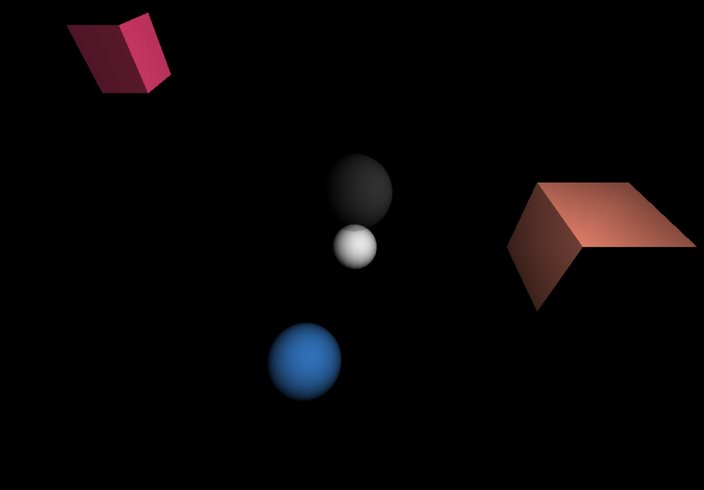

On constate que les Mesh sont maintenant visibles sans que notre scène n'est de couleur de fond. L'allule des Mesh n'est donc pas la même qu'avec un *MeshBasicMaterial*. En effet, les différentes faces dépendent de l'éclairage et ne sont pas donc toutes vidibles de la même manière.

&nbsp;

**4) Ajouter une interface réalisée avec la bibliothèque dat-gui permettant de contrôler la position de la lumière dans la scène.**  

On créer une fonction dat_gui prenant un argument un élément qui instancie notre interface. Cette dernière permettra ainsi d'influer sur l'élément passé en paramètre. Le contenu de cette fonction sera détaillé juste après.

    function dat_gui(element){
        var gui = new dat.GUI();
    }

Dans un premier temps on donne une valeur de base à chaque paramètre qui pourra être controlé depuis l'interface.  
Ici on créer un paramètre par axe sur lequel pourra se déplacer notre source de lumière. On associe à chacun la valeur qui à été assigné à la shère avec la fonction position().

    var parameters = {
        lightx: element.position.x,
        lighty: element.position.y,
        lightz: element.position.z,
    };

Ensuite on associe chaque paramètre de l'interface graphique une plage de valeurs sur laquelle il peut évoluer ainsi que son pas.

    var light_pos = gui.addFolder('Position');
    var val_x = light_pos.add( parameters, 'lightx' ).min(0).max(20).step(1).listen();
    var val_y = light_pos.add( parameters, 'lighty' ).min(0).max(20).step(1).listen();
    var val_z = light_pos.add( parameters, 'lightz' ).min(0).max(20).step(1).listen();
    light_pos.open();

Enfin on créer une sous-fonction par paramêtre. On y définit l'action qu'aura sa modification sur l'élément passé en paramètre au départ.

    val_x.onChange(
        function(value) { 
            element.position.x = value;
            }
    );
        
    val_y.onChange(
        function(value) { 
            element.position.y = value;
        }
    ); 
       
    val_z.onChange(
        function(value) { 
            element.position.z = value;
        }
    ); 

Pour ajouter un panneau de contrôle lié à notre source de lumière on rajoute ainsi l'instruction suivante après l'avoir ajouté à la scène.

    dat_gui(sphere_lum);

On peut ainsi déplacer notre lumière comme cela :
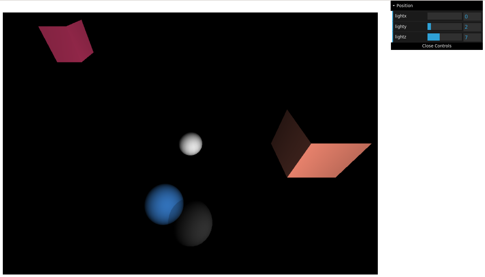

&nbsp;

**5) Ajouter la navigation à la souris en utilisant la classe OrbitControls.**

La déplacement à la souris dans la scène se fait par la création d'une variable globale dans le script. Celle-ci étant une instance de la classe *OrbitControls*.

    controls = new THREE.OrbitControls( camera, renderer.domElement );

On ajoute aussi à la fonction animate() de notre script js l'instruction suivante :

    controls.update();

Ainsi on peut se déplacer dans notre scène et voir nos Mesh sous un autre angle.
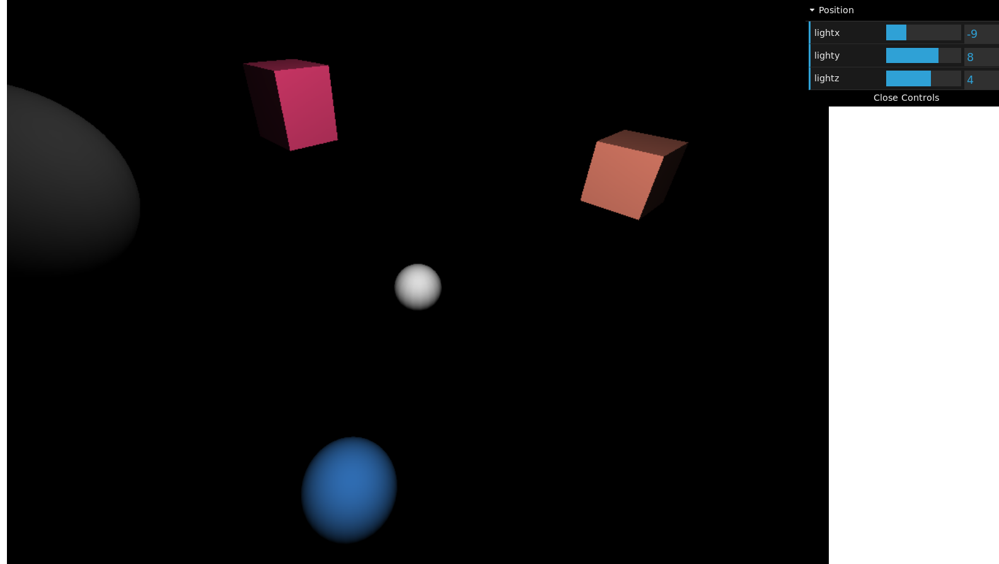

&nbsp;

**6) Créer une petite scène montrant votre compréhension des différents objets géométriques fournis dans Three.js.**

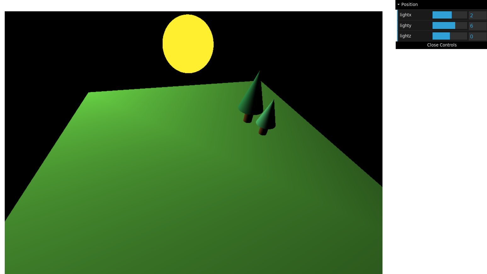
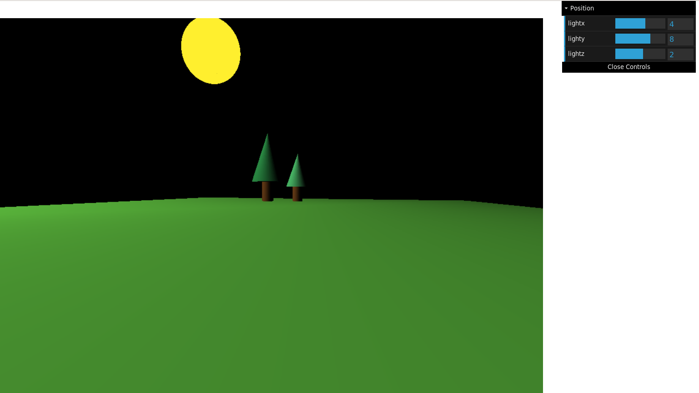

&nbsp;
_____________________

## TP2

**1) Utiliser la classe OBJLoader (bibliothèque OBJLoader.js fournie) pour créer un Mesh dont la géométrie est décrite dans un fichier OBJ et l'ajouter à la scène.**

On essaie dans un premier temps d'ajouter un lapin à la scène. On créer une variable lapin ainsi qu'une instance de *OBJLoader*.

    var lapin;
    var loader = new THREE.OBJLoader();

Puis on appel la fonction load sur notre *OBJLoader*. On lui donne notre fichier .obj à importer. Puis on associe l'objet à notre variable lapin et on effectue les différentes transformations voulues (position, changement de taille, rotation...)

    loader.load(
        'bunny.obj',
        function(object){
            lapin=object;
            lapin.position.set(0,-0.22,0);
            scene.add(lapin);
        },
        function(xhr){console.log((xhr.loaded/xhr.total*100)+'% loaded');},
        function(error){console.log('An error happened');},
    )

&nbsp;

**2) Vérifier que les données sont bien importées. Vous serez peut-être confrontés à un problème de sécurité.**

L'erreur de sécurité empéche effectivement d'importer correctement le lapin en obj. Pour régler le problème, on installe l'extention Live Server proposée par VSCode afin de faire tourner un serveur local.

&nbsp;

**3) Essayer d'importer différents objets. Que constate-t-on ?**

De même que pour le lpin dans le 1) on ajoute maintenant une vâche à la scène avec le code ci-après.

    var cow;
    var loader2 = new THREE.OBJLoader();
    loader2.load(
        'cow.obj',
        function(object){
            cow=object;
            cow.position.set(-2,1.3,3);
            scene.add(cow);
        },
        function(xhr){console.log((xhr.loaded/xhr.total*100)+'% loaded');},
        function(error){console.log('An error happened');},
    )

On remarque que nos objets sont totalement disproportionnés, le lapin est à peine visible tant il est petit, tandis que la vâche est énorme, elle couvre donc la quasi-totalité de notre scène de forêt.

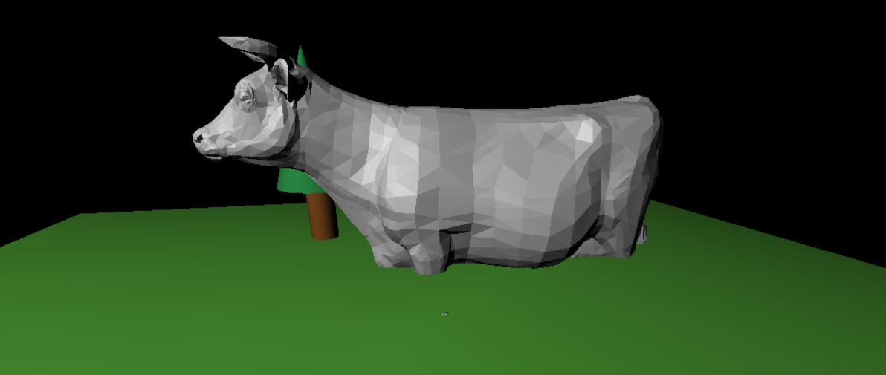
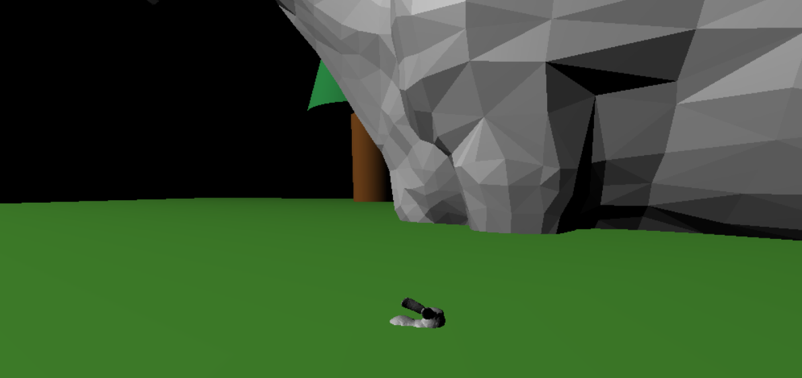

Pour parlier à ce problème de proportion on applique des transformation sur la taille de nos objets à l'aide de l'attribut *scale* dans function(object) du *load*.

Pour le lapin il s'agit d'augmenter sa taille :

    lapin.scale.x = 5;
    lapin.scale.y = 5;
    lapin.scale.z = 5;

Tandis que pour la vâche il s'agit de la rendre plus petite :

    cow.scale.x = 0.35;
    cow.scale.y = 0.35;
    cow.scale.z = 0.35;

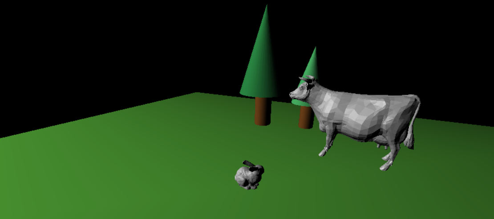

&nbsp;

**4) Maintenant que tous les objets ont une hauteur standard, calculer la translation verticale pour que l'objet soit positionné à la hauteur du sol. Appliquer la translation verticale.**

En premier lieu on calcule les dimensions de notre objet à l'aide d'une boite englobante *BoxHelper*. Ainsi nous auront accès aux coordonnées des minimums et maximums pour chaque axe de notre vâche.

    var box = new THREE.BoxHelper( cow, 0xffff00 );         
    box.geometry.computeBoundingBox()
    cow.add(box);

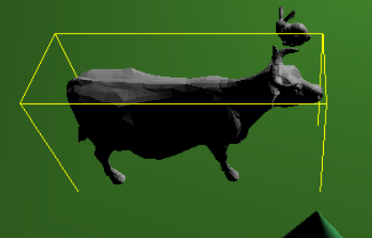

Puisque l'on souhaite placer notre vâche au niveau du sol, il faut que notre translation amène la coordonnée minimum de celle-ci sur l'axe y à 0. On modifie donc la position de notre objet comme suit :

    cow.position.set(-2,-box.geometry.boundingBox.min.y,3);

On fait de même pour notre lapin ce qui nous donne le résultat ci-dessous.
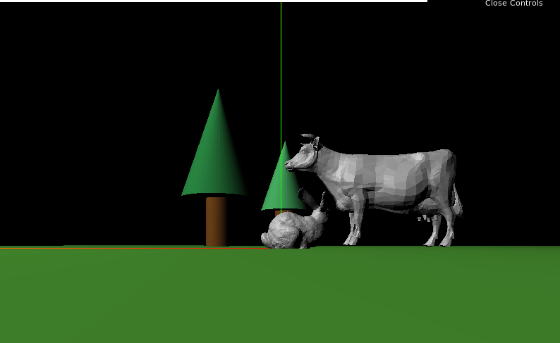

&nbsp;

**5) Refactorer maintenant le code pour en faire une fonction qui prenne en paramètre le nom du fichier et la hauteur cible pour importer autant d'objets que voulus et spécifier la taille cible.**

On créer une nouvelle fonction apellée import_obj, celle-ci prends plusieurs paramètres :

- name : le nom du fichier obj à importer
- hauteur : un coefficient de taille que l'on veut donner à notre objet
- scene : la scène à laquelle ajouter l'objet
- posX : la coordonnée en x pour savoir où le placer dans la scène
- posY : la coordonnée en y pour savoir où le placer dans la scène
- posZ : la coordonnée en z pour savoir où le placer dans la scène
- coeff_rot : nombre de rotation de pi/16 (soit 11,25°)

&nbsp;

    function import_obj(name,hauteur,scene,posX,posZ,coeff_rot){
        var loader = new THREE.OBJLoader();
    }

On écrit ensuite la fonction *load* comme présentée dans le 1).

    loader.load(
        name,
        function(object){
             ...
        },
        function(xhr){console.log((xhr.loaded/xhr.total*100)+'% loaded');},
        function(error){console.log('An error happened');},
    )

Dans la fonction(object) on commence par ajouter l'objet à la scène et on calcule les dimensions de notre objet avec sa *BoxHelper*

    obj=object;
    scene.add(obj);
    var box = new THREE.BoxHelper( obj, 0xffff00 );
    box.geometry.computeBoundingBox();

On calcule ensuite la hauteur h de notre objet ce qui nous permet de faire une mise à l'échelle de celui-ci. Ce coeff est ensuite multiplié par la hauteur souhaité passée en paramètre afin de redéfinir la taille de l'objet.

    var h = box.geometry.boundingBox.max.y - box.geometry.boundingBox.min.y 
    var coeff = 1/h;
    obj.scale.x = hauteur * coeff;
    obj.scale.y = hauteur * coeff;
    obj.scale.z = hauteur * coeff;

Suite à la transformation qui a été effectuée sur la taille de l'objet, la *BoxHelper* créé précedemment ne correspond plus aux bonnes dimensions. On en fait alors une nouvelle pour la translation de mise au niveau du sol.

    var box2 = new THREE.BoxHelper( obj, 0xffff00 );
    box2.geometry.computeBoundingBox();
    obj.position.set(posX,-box2.geometry.boundingBox.min.y,posZ);

Enfin on applique la rotation passée en paramètre.

    obj.rotation.y = coeff_rot * Math.PI / 16;

Suite à la création de notre fonction import_obj() les ajouts d'objets se font à présent de la manière suivante :

        import_obj('bunny.obj',0.8,scene,2,2,-5);
        import_obj('cow.obj',2,scene,-2,3,0);

&nbsp;

**6) On constate que les objets fournis avec le TP ne sont pas lisses. Trouver une méthode pour lisser les objets.**

Pour lisser les objets on rajoute dans notre le load de notre fonction import_obj() un bloc de code entre les deux lignes suivante :

    obj=object;
    scene.add(obj); 

On récupère les informations liés à la géométrie de notre obj et on fusionne ses différentes sommets avec la fonction *mergeVertices()*.

    var smooth = new THREE.Geometry().fromBufferGeometry(obj.geometry.clone());
    smooth.mergeVertices();

A la suite de cela on créer un nouveau Mesh qui se sert de notre *Geometry* comme base plutôt de d'un fichier .obj. Enfin on calcule les nouvelles normales de notre objet afin de rendre le lissage effectif.

    var obj_smooth = new THREE.Mesh(
        smooth,
        new THREE.MeshPhongMaterial({ color: "#b9b0ad" })
    );
    obj_smooth.geometry.computeVertexNormals();

La suite des instructions du load qui étaient faites sur obj utilisent maintenant obj_smooth. Le résultat obtenu sur la vâche est le suivant :

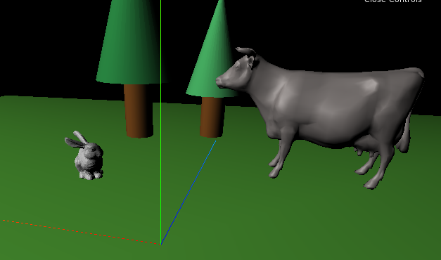

&nbsp;

**7) Sur le même principe que pour l'OBJLoader, utiliser la classe MTLLoader (bibliothèque MTLLoader.js fournie) pour importer un mesh et ses textures et l'ajouter à la scène.**

On créer une nouvelle fonction apellée import_mlt sur le même principe que importe_obj, celle-ci prends plusieurs paramètres :

- name_mtl : le nom du fichier mlt à importer
- name_obj : le nom du fichier obj à importer
- hauteur : un coefficient de taille que l'on veut donner à notre objet
- scene : la scène à laquelle ajouter l'objet
- posX : la coordonnée en x pour savoir où le placer dans la scène
- posY : la coordonnée en y pour savoir où le placer dans la scène
- posZ : la coordonnée en z pour savoir où le placer dans la scène
- coeff_rot : nombre de rotation de pi/16 (soit 11,25°)

&nbsp;

    function import_mtl(name_mtl,name_obj,hauteur,scene,posX,posZ,coeff_rot){
        var mtlloader = new THREE.MTLLoader();
    }

On écrit ensuite la fonction *load* de notre mtlloader.

     mtlloader.load(
        name_mtl,
        function(materials){
                ...
        },
        function(xhr){console.log((xhr.loaded/xhr.total*100)+'% loaded');},
        function(error){console.log('An error happened mtl');},
    )

Dans la fonction(materials) on a le même code que celui de import_obj() à l'exception près que l'on ajoute l'instruction setMaterial() qui permet de lier la texture à l'objet.

    var objLoader = new THREE.OBJLoader();
    objLoader.setMaterials(materials)
    objLoader.load(...);

Grâce à notre fonction on ajoute un sabre à notre scène avec l'instruction suivante qui nous donne le résultat ci-après.

        import_mtl('saber.mtl','saber.obj',0.4,scene,4,-1,8)

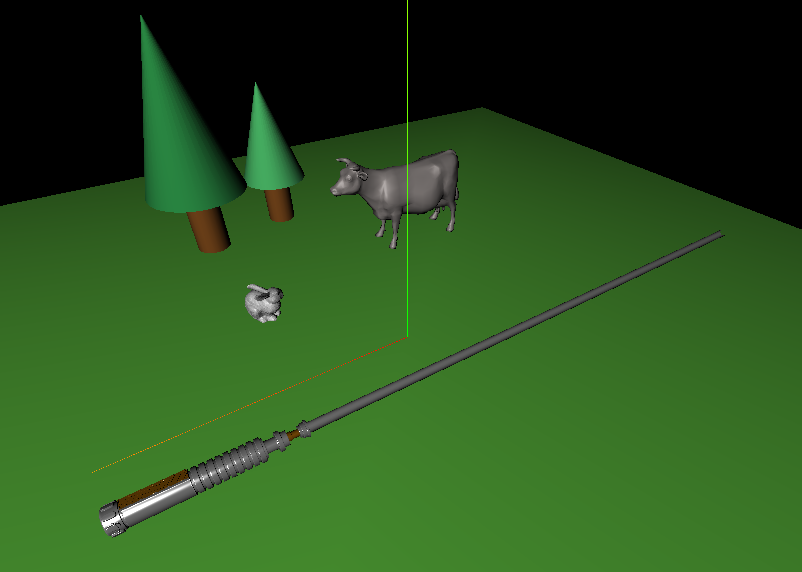
