# Rapport n°2 P4x

## TP3

**1) Ajouter un objet simple, de préférence ayant des surfaces arrondies (sphère, tore, donut, etc), à la manière du TP1. Cet objet servira de support de travail pour la suite. Changer le matériau de l'objet pour la classe ShaderMaterial. Un matériau utilisant des shaders nécessite de fournir le code pour le vertex shader et le pixel shader.**

Pour la création du vertex shader et du pixel shader on reprend le code de l'exemple *basicshader.html*. Puis on crée notre sphère simplement en lui associant le *shaderMaterial* de notre création comme suit :

    geometry_sphere = new THREE.SphereGeometry(1,25,25);
    var sphere = new THREE.Mesh(geometry_sphere,shaderMaterial);
    sphere.position.set(4,1.5,-1);

Le résultat obtenu est le suivant :  

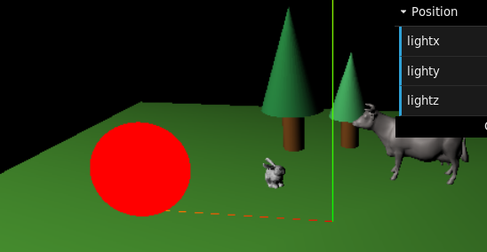

&nbsp;

**2) Vérifier que le programme utilise bien les shaders fournis par exemple en modifiant le code du pixel shader en changeant la couleur codée en dur.**  

On redéfinit la couleur que prendra notre shader avec l'instruction suivante :

    gl_FragColor = vec4(0.5, 0.0, 0.8, 1.0);

Et on observe alors le résultat ci-dessous, qui nous prouve le fonctionnement de notre shader.  

  

&nbsp;

**3) Modifier le pixel shader pour passer une couleur en tant qu'uniform pour modifier à la volée la couleur de l'objet.**  

On ajoute l'attribut uniform *rgb* à notre pixel shader, qui est un vecteur à 3 dimensions. On remplace alors aussi le vecteur *gl_FragColor* et on ajoute *rgb* à notre *shaderMaterial* comme dans l'exemple *uniform.html*.

    uniform vec3 rgb;

    gl_FragColor = vec4(rgb, 1.0);

La couleur du shader dépend alors de 3 variables r, g et b qui sont définits après l'instanciation de notre sphère.

&nbsp;

**4) Connecter la valeur de cette couleur sur une interface dat-gui. Observez les changements de couleurs en fonction de vos changements dans l'interface.**  

Dans un premier temps j'ai souhaité changer la couleur du mesh à l'aide d'une interface spécifique aux couleurs, semblable à celle ci-après.  

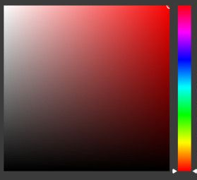 

J'ai alors créé une nouvelle fonction *dat_gui_color()*. Pour cela je me suis inspirée de ce que j'ai trouvé sur [ce forum](https://discourse.threejs.org/t/select-objects-with-mouse-and-change-color-with-dat-gui-solved/4804/4). Je souhaitais récupérer pour l'initialisation, la couleur de mon mesh à l'aide de l'instruction suivante :

    color: element.material.uniforms.rgb.value,

Puis, il s'agissait de modifier la couleur du mesh à l'aide d'un *setStyle()* prenant en paramètre une valeur en hexadécimal.

    element.marerial.color.setStyle(value);

Le résultat ne compilant absolument pas, je me suis alors tournée vers la solution de gérer les valeurs de r, g et b indépendamment. Ces dernières sont stockées dans notre vecteur uniform sous forme de flotant entre 0 et 1. On les multiplie alors par 255 pour obtenir leur valeur sur 8 bits, puis on divise par 1 afin d'avoir des valeurs entières.

    color_r : ((element.material.uniforms.rgb.value.x)*255)/1,
    color_g : ((element.material.uniforms.rgb.value.y)*255)/1,
    color_b : ((element.material.uniforms.rgb.value.z)*255)/1,

Puis, j'ai suivis simplement le même modèle que le changement de position de mon soleil. Cela m'a alors permis d'obtenir le résultat suivant :  

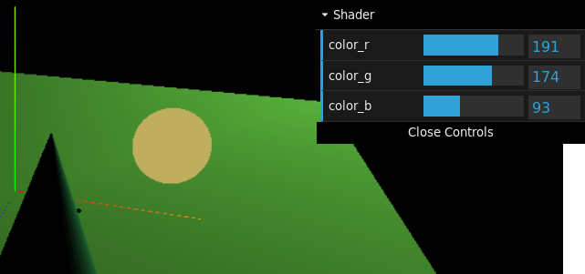 

Cependant, en faisant varier les couleurs je me rends compte que celles-ci réagissent assez bizarrement. Le résultat obtenu ne correspondant pas toujours à celui attendu. Le plus gros bug étant la disparition d'une couleur quand on la met à 255.  

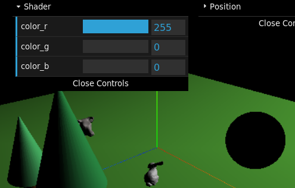 

Le problème vient en fait du %255/255 que l'on applique à nos couleurs pour les reconvertir sous forme de flottant entre 0 et 1. En effet, 255%255 équivaut à un 0. On remplace alors dans le code tous les 255 par 256 pour résoudre le souci.

Enfin, pour régler mon souci de correspondance de couleurs, j'ai demandé de l'aide à Elio afin de mettre en place mon idée de base sur l'interface spécifique aux couleurs.

Ne sachant toujours pas comment récupérer la couleur de mon mesh sous forme hexadécimale, j'ai simplement entré en dur le code couleur correspondant à celui que je lui assigne lors de sa création dans la fonction init().

    var parameters = {
        color: "#44abd7"
    };

Puis, lors du changement de couleur, je passe à présent par des substring de la valeur héxadécimale, que je stocke ensuite sous forme de flottants comme expliqué auparavant.

    var b = parseInt(parameters.color.substring(5,7),16);
    element.material.uniforms.rgb.value.set(r%256/256,g%256/256,b%256/256);

Ce qui me donne ainsi, le résultat ci-dessous.  

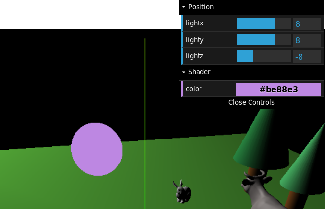

&nbsp;

**5) Utiliser la classe VertexNormalsHelper pour visualiser les normales de votre objet.**

Dans un premier temps, j'importe la librairie *VertexNormalsHelper* de three.js qui se trouve [ici](https://github.com/mrdoob/three.js/blob/master/examples/jsm/helpers/VertexNormalsHelper.js). Afin de pouvoir supprimer les imports d'autres librairies, je place un 'THREE.' devant chaque objet.

Ensuite, j'instancie mon *VertexNormalsHelper* en lui donnant en paramètre le mesh concerné, la longueur des normales, leur couleur et enfin leur épaisseur.

    var vertex_helper = new VertexNormalsHelper(sphere, 1, 0x00ff00, 0.5);
    scene.add(vertex_helper);

Je réduis ensuite le nombre de segments de ma sphère quand je la crée, afin d'obtenir un résultat plus visible.  

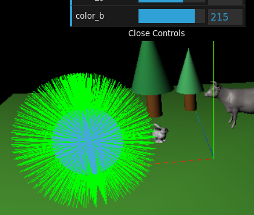

&nbsp;

**6) Transmettre les normales du mesh depuis le vertex shader au pixel shader. Vous devrez utiliser la fonctionnalité varying de GLSL.**

Dans notre vertex shader on crée un vecteur de dimension 3 en utilisant le varying. On place ensuite la même instruction dans le pixel shader afin de récupérer ce vecteur.

    varying vec3 normales;

Notre vecteur *normales* est initialisé grâce à l'attribut *normal* du vertex shader, qui contient, comme son nom l'indique, les informations sur les normales de notre objet.

    normales = normal;

Enfin, on vérifie le fonctionnement de nos normales en utilisant leurs informations pour colorer notre sphère.

    gl_FragColor = vec4(normales, 1.0);

On voit alors que notre code fonctionne puisque notre sphère possède à présent un dégradé arc-en-ciel.  

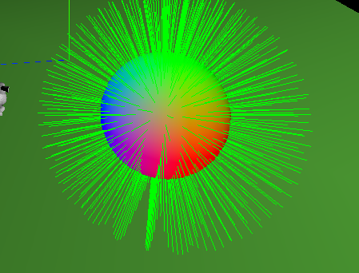

&nbsp;

**7) Passer la position DANS LE REPERE DE LA SCENE de la surface de l'objet du vertex shader au pixel shader. Faire attention aux repères utilisés.**

Le vecteur de dimension 4 intitulé *wolrdPos* qui est calculé dans notre vertex schader correspond à la position (dans le repère de la scène) de la surface de l'objet. Ainsi, on sort la déclaration de *worlPos* du main pour en faire une variable accessible par varying.

    varying vec4 worldPos;

Puis, de la même manière que pour la transmission des normales, on place à nouveau la même instruction de varying dans notre pixel shader.

&nbsp;

**8) Passer en tant qu'uniform la position DANS LE REPERE DE LA SCENE de la lumière ajoutée lors du TP1.**

Tout comme à la question 3) on ajoute un vecteur de dimension 3 à notre pixel shader en uniform.

    uniform vec3 pos_lum;

On définit ensuite ce vecteur *pos_lum* dans notre code js, et on l'ajoute à notre liste de variable uniform en plus du *rgb*.

    myPosUniform_lum = { type: "v3", value: new THREE.Vector3() };
    myUniforms = { rgb : myRGBUniform, pos_lum : myPosUniform_lum };

Enfin, on initialise notre vecteur *pos_lum* avec les coordonnées de notre *PointLight*.

    shaderMaterial.uniforms.pos_lum.value.set(sun.position.x,sun.position.y,sun.position.z);

&nbsp;

**9) Avec la couleur, la normale, la position de la surface et la position de lumière, il y a maintenant tout ce qu'il faut pour calculer un éclairage de Lambert (dot product/cosinus).**

La [page wikipedia de l'éclairage de lambert](https://en.wikipedia.org/wiki/Lambertian_reflectance), nous donne la formule ci-dessous à appliquer dans notre pixel shader.

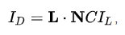

Avec :

- Id : l'intencité de la lumière à la surface de notre sphère
- L : le vecteur directeur de la lumière
- N : le vecteur de la normale
- C : la couleur de la sphère
- Il : l'intensité de la lumière provenant de la source de lumière (dont on ne se servira pas ici)

Dans notre pixel shader on crée ainsi, un vecteur *lambert* dans lequel on stockera le résultat de notre formule.

    vec3 lambert = dot(normalize(pos_lum - worldPos.xyz),normales) * rgb;

On utilise .xyz sur le vecteur *worldPos* afin de récupérer uniquement les informations sur ces 3 composantes étant donné qu'il s'agit d'un vec4. Le vecteur L de la formule correspond donc à la différence entre la position de notre lumière et celle de notre sphère. Afin d'avoir un résultat plus significatif, on normalise ce dernier.

À l'aide de la fonction *dot()*, on réalise ensuite le produit scalaire de L et N, le vecteur *normales* correspondant à N.

Puis, on multiple le résultat par notre vecteur *rgb* afin d'appliquer la couleur à notre sphère.

Enfin, on utilise notre vecteur *lambert* pour l'affichage de notre sphère.

    gl_FragColor = vec4(lambert, 1.0);

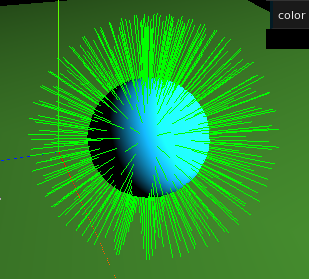

&nbsp;

**10) Varier la position de votre lumière et observez les changements.**

Afin d'influer sur mon shader avec la position de mon *PointLight*, je modifie ma fonction *dat_gui_position()* en lui rajoutant le *shaderMaterial* en paramètre. En effet, lorsque je bouge ma source de lumière, il faut aussi que je puisse mettre à jour les coordonnées de cette dernière qui sont stockées dans le vecteur uniform *pos_lum* de mon pixel shader.

J'ajoute alors simplement à la fonction *onChange()* de chaque paramètre, l'instruction suivante, en l'adaptant à chaque fois à l'axe concerné.

    shaderMaterial.uniforms.pos_lum.value.x = value;

En plaçant ma lumière au-dessus de ma sphère, on voit alors bien notre *shaderMaterial* se modifier en conséquence :  

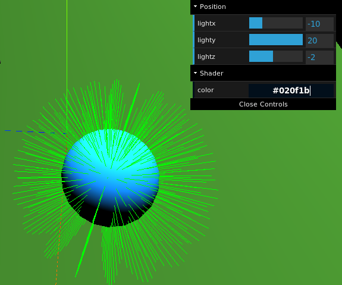

&nbsp;

**11) Ajouter un jeu de test fiable prouvant que le calcul d'éclairage est juste.**

Dans un premier temps, je crée simplement 3 autres sphères en suivant l'exemple donné par le sujet, afin de tester la réaction de mon *shaderMaterial*. Je me rends alors compte que celui-ci réagit plutôt correctement quand ma lumière est positionnée loin de mes sphères comme on peut le voir ci-dessous.  

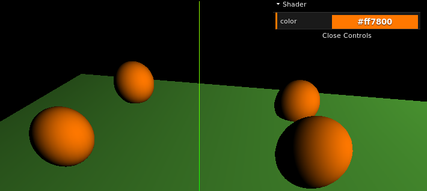

Cependant, en plaçant ma lumière au centre de mes 4 sphères, on voit alors que toutes suivent la même direction d'éclairage, elles ne sont donc pas indépendantes. De plus, la zone éclairée ne correspond même pas à la bonne direction.  

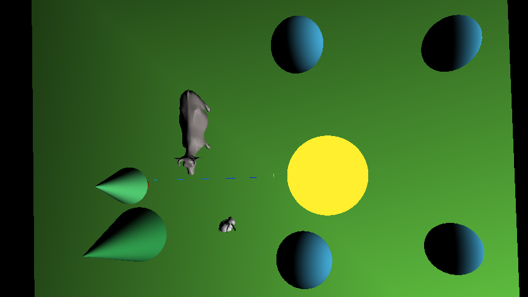

Le problème venait en fait de mon vecteur *worldPos*, en faisant un copier-coller, j'ai laissé le 'vec4' servant à sa déclaration dans le main de mon vertex shader. Une fois cette erreur corrigée, on observe alors bien le résultat attendu.  

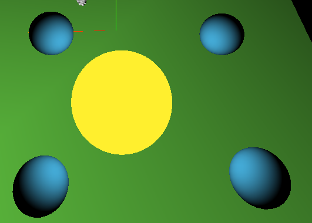

&nbsp;

**12) On peut éventuellement prendre en compte aussi la couleur de la lumière en multipliant le résultat du calcul d'éclairage par cette couleur.**

Comme expliqué au point 9) dans le code de notre pixel shader, il nous suffit de faire une multiplication par le vecteur uniform *rgb* dans le calcul de notre vecteur *lambert*.

    vec3 lambert = dot(normalize(pos_lum - worldPos.xyz),normales) * rgb;

&nbsp;

**13) Utiliser les valeurs calculées de l'éclairage de Lambert comme critère de seuillage pour obtenir des aplats de couleurs grâce au pixel shader.**

La mise en place du seuillage se réalise facilement à partir de la fonction *ceil()*. On divise notre vecteur *lambert* par un flottant entre 0 et 1, ce dernier correspondant à l'inverse du nombre de plages couleurs. Ici, on divise donc par 0.25 afin d'obtenir 4 aplats de couleurs différents sur nos objets.

    ceil(lambert/0.25)

Enfin, on multiplie à nouveau par le vecteur *rgb* après le seuillage pour ajouter de la couleur à notre mesh. En effet, lors de la division de notre vecteur *lambert* par notre flottant, l'information sur les couleurs se retrouve altérée.

    gl_FragColor = vec4(ceil(lambert/0.25)*rgb, 1.0);

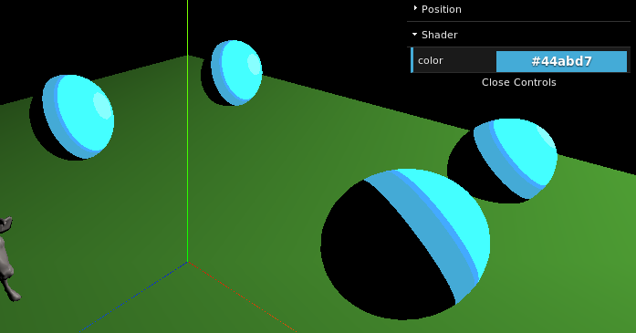

&nbsp;

**14) Utilisation des shaders sur les meshs OBJ.**

Pour la fin du TP, j'ai choisi d'essayer d'implémenter les shader sur les obj.

Dans un premier temps, j'ai modifié ma fonction *import_obj()* en lui ajoutant un nouveau paramètre correspondant au *shaderMaterial* à appliquer sur le mesh obj.

    function import_obj(name,hauteur,scene,posX,posZ,coeff_rot,material){}
    import_obj('Orange.obj',1.5,scene,8,-1,shaderMaterial);

Pour importer un obj sans lui associer de matériau en particulier, comme on le faisait auparavant, il suffit alors simplement de passer *null* en paramètre.

    import_obj('bunny.obj',0.8,scene,2,2,-5,null);

J'ai alors testé deux manières d'associer mon *shaderMaterial* aux obj, mais cela fut sans succès. Aucune des deux méthodes ne lançant d'erreur dans la console, je n'ai pas su comment les débugger pour trouver d'où venait le problème.

Ma première idée fut de me baser sur l'import des mtl. En effet, pour charger les textures, on associe le fichier .mtl comme matériau à notre obj à l'aide de la fonction *setMaterial()* sur notre *OBJLoader*. J'ai donc ajouté les instructions suivantes juste après l'instanciation de mon *OBJLoader*.

    if(material != null){
        loader.setMaterials(material);
    }

Ma deuxième idée fut inspirée par la méthode de lissage des obj. En effet, lors du lissage, on crée un nouveau mesh à l'aide des informations sur la géométrie de l'obj et d'un matériau à utiliser. J'ai donc voulu faire de même en passant en paramètre mon obj tel quel ainsi que mon *shaderMaterial*. Ce qui m'a donné le code suivant :

    if(material != null){
        obj = new THREE.Mesh(obj,material);
    }
