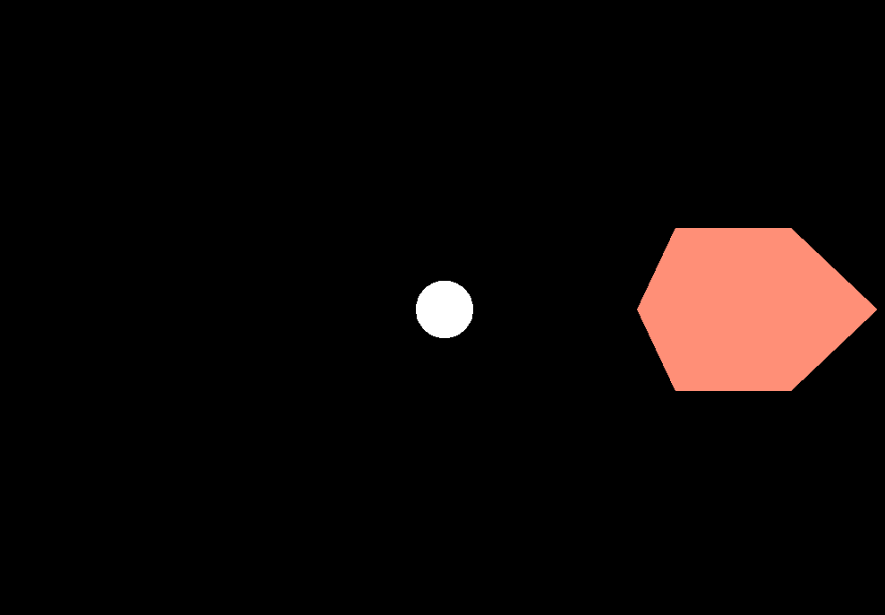

# Rapport n°1 P4x

### TP1

**1) Ajouter plusieurs Mesh simples comme des cubes (BoxGeometry) ou des sphères
 (SphereGeometry) avec un matériau coloré basique (MeshBasicMaterial).**

Dans le fichier *scene.js* on créer une instance de Mesh.
Le constructeur demande une taille (largeur, hauteur, profondeur) ainsi qu'un matériau.  
'''
    var box1 = new THREE.Mesh(
        new THREE.BoxGeometry(2,2,2),
        new THREE.MeshBasicMaterial( { color: "#FF8F77" })
    );
'''
Puis on définit la position de notre Mesh sous la forme ().
        box1.position.set(5,5,5); //origine du cube

Enfin on ajoute notre Mesh à la scène.
        scene.add(box1);

Le résultat obtenu est le suivant :  
  
