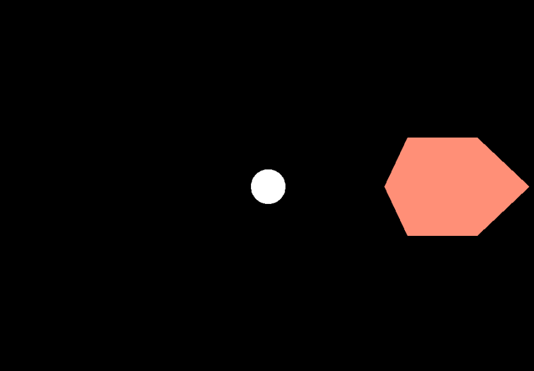
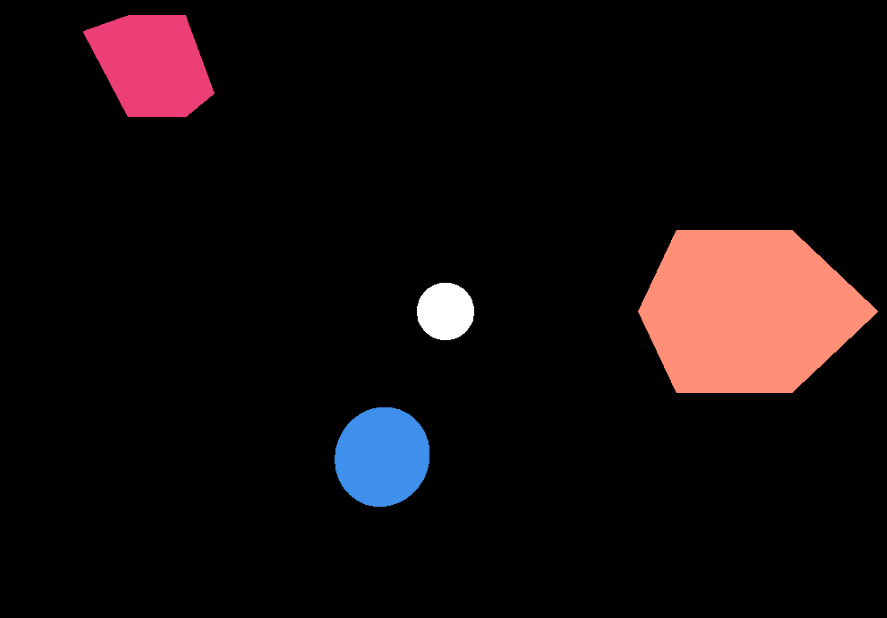
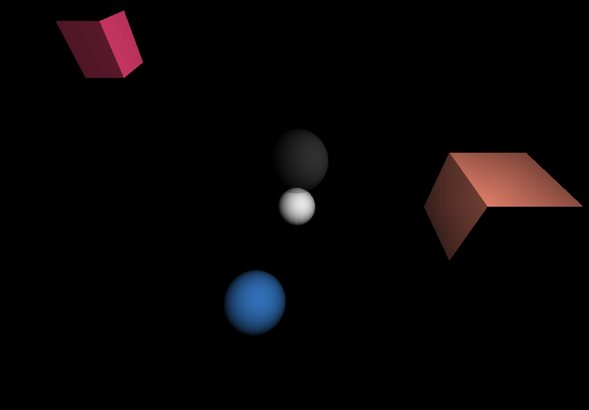
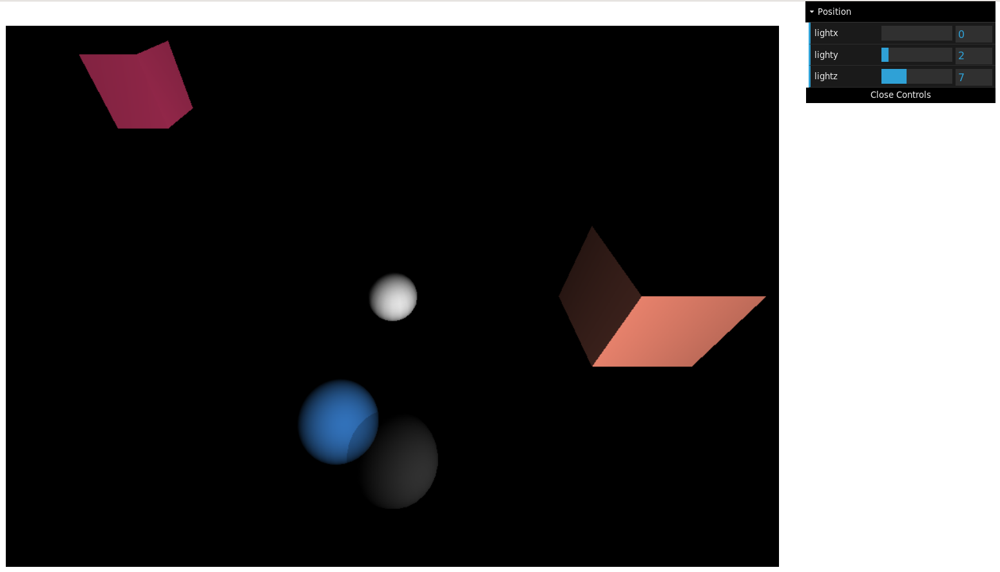
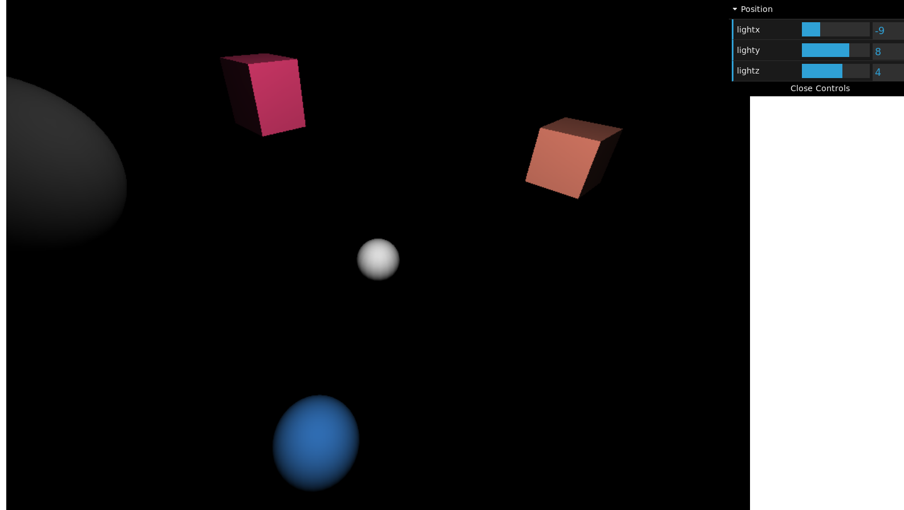
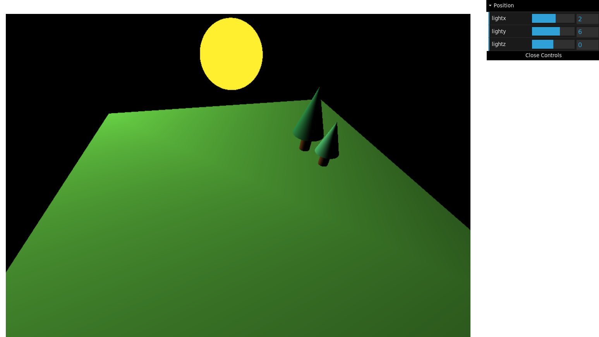
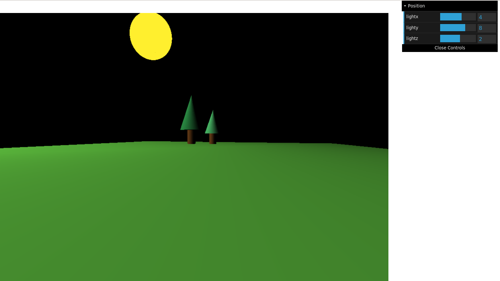

# Rapport TP1 : Prise en main de Three.js

**1) Ajouter plusieurs Mesh simples comme des cubes (BoxGeometry) ou des sphères (SphereGeometry) avec un matériau coloré basique (MeshBasicMaterial).**

Dans le fichier *scene.js* on crée une instance de Mesh.
Le constructeur demande le type de composant et une taille, ici il s'agit d'un *BoxGeometry* donc on lui donne sous la forme (largeur, hauteur, profondeur), ainsi qu'un matériau avec sa couleur.  

    var box1 = new THREE.Mesh(
        new THREE.BoxGeometry(2,2,2),
        new THREE.MeshBasicMaterial( { color: "#FF8F77" })
    );
Puis on définit la position de notre Mesh sous la forme (x,y,z).

    box1.position.set(5,5,5);
  
Enfin on ajoute notre Mesh à la scène.

    scene.add(box1);

Le résultat obtenu est le suivant :  
  

De même on rajoute ensuite d'autres Mesh à notre scène, qui ressemble alors à ça :

&nbsp;

**2) Changer le matériau utilisé pour les objets pour un MeshLambertMaterial. Que constate-t-on ?**  

Dans le constructeur de nos Mesh on remplace la ligne correspondant au matériau par :

    new THREE.MeshLambertMaterial( { color: "#FFFFFF" })

Nos Mesh ne sont alors plus visibles car les *meshLambertMaterial* ont besoin d'une source de lumière.

On peut tout de même les "voir" en donnant au fond de notre scène une couleur ce qui fait alors ressortir nos Mesh en noir.
Pour cela on ajoute à notre script l'instruction :

    scene.background = new THREE.Color( 0xff0000 ); 

&nbsp;

**3) Ajouter une lumière ponctuelle à la scène ainsi qu'une sphère transparente qui matérialise cette source de lumière. Que constate-t-on maintenant ?**  

L'ajout de la source de lumière à la scène se fait à l'aide de l'instanciation d'un *PointLight* comme suit.

    var pointLight = new THREE.PointLight( 0xffffff, 1, 100 );
    pointLight.position.set( 3, 3, 3 );

On place ensuite la lumière dans une sphère transparente. Pour cela on crée en premier lieu un simple Mesh comme dans le 1) auquel on ajoute des paramètres dans la définition du matériau qui le compose. On joue alors avec les attributs *opacity* et *transparent*.

    var sphere_lum = new THREE.Mesh(
        new THREE.SphereGeometry(1,30,30),
        new THREE.MeshLambertMaterial( 
            { color: "#FFFFFF", opacity :0.2, transparent: true }
        )
    );

Ensuite on ajoute notre *PointLight* à notre sphère. On assigne alors une postion à la sphère et il ne reste plus qu'à l'ajouter à la scène.

    sphere_lum.add(pointLight);
    sphere_lum.position.set(3,3,3);
    scene.add( sphere_lum );

Cela nous donne le résultat ci-dessous. La sphère grise transparente contenant la source de lumière.

On constate que les Mesh sont maintenant visibles sans que notre scène n'ait de couleur de fond. L'allure des Mesh n'est donc pas la même qu'avec un *MeshBasicMaterial*. En effet, les différentes faces dépendent de l'éclairage et ne sont donc pas toutes visibles de la même manière.

&nbsp;

**4) Ajouter une interface réalisée avec la bibliothèque dat-gui permettant de contrôler la position de la lumière dans la scène.**  

On crée une fonction dat_gui prenant un argument un élément qui instancie notre interface. Cette dernière permettra ainsi d'influer sur l'élément passé en paramètre. Le contenu de cette fonction sera détaillé juste après.

    function dat_gui(element){
        var gui = new dat.GUI();
    }

Dans un premier temps, on donne une valeur de base à chaque paramètre qui pourra être contrôlé depuis l'interface.  
Ici on crée un paramètre par axe sur lequel pourra se déplacer notre source de lumière. On associe à chacun la valeur qui a été assignée à la sphère avec la fonction position().

    var parameters = {
        lightx: element.position.x,
        lighty: element.position.y,
        lightz: element.position.z,
    };

Ensuite on associe chaque paramètre de l'interface graphique une plage de valeurs sur laquelle il peut évoluer ainsi que son pas.

    var light_pos = gui.addFolder('Position');
    var val_x = light_pos.add( parameters, 'lightx' ).min(0).max(20).step(1).listen();
    var val_y = light_pos.add( parameters, 'lighty' ).min(0).max(20).step(1).listen();
    var val_z = light_pos.add( parameters, 'lightz' ).min(0).max(20).step(1).listen();
    light_pos.open();

Enfin on crée une sous-fonction par paramêtre. On y définit l'action qu'aura sa modification sur l'élément passé en paramètre au départ.

    val_x.onChange(
        function(value) { 
            element.position.x = value;
            }
    );
        
    val_y.onChange(
        function(value) { 
            element.position.y = value;
        }
    ); 
       
    val_z.onChange(
        function(value) { 
            element.position.z = value;
        }
    ); 

Pour ajouter un panneau de contrôle lié à notre source de lumière on rajoute l'instruction suivante une fois que la sphère a été ajoutée à la scène.

    dat_gui(sphere_lum);

On peut ainsi déplacer notre lumière comme cela :

&nbsp;

**5) Ajouter la navigation à la souris en utilisant la classe OrbitControls.**

La déplacement à la souris dans la scène se fait par la création d'une variable globale dans le script. Celle-ci étant une instance de la classe *OrbitControls*.

    controls = new THREE.OrbitControls( camera, renderer.domElement );

On ajoute aussi à la fonction animate() de notre script js l'instruction suivante :

    controls.update();

Ainsi on peut se déplacer dans notre scène et voir nos Mesh sous un autre angle.

&nbsp;

**6) Créer une petite scène montrant votre compréhension des différents objets géométriques fournis dans Three.js.**

On crée un sol à l'aide d'un *BoxGeometry* ayant une faible hauteur. Puis on crée deux arbres constitués tous deux de deux *CylinderGeometry*. Les cylindres représentant le feuillage possèdent une base large, alors que l'autre bout est très petit, ainsi qu'un grand nombre de segments. Dans le code on a alors par exemple :

    new THREE.CylinderGeometry(0.3,0.3,2,20),

On place un soleil comme source de lumière pour notre scène. On souhaite que celui-ci soit visible donc la sphère dans laquelle on la met est constituée d'un *MeshBasicMaterial*. Contrairement à tous nos autres éléments qui eux sont des *MeshLambertMaterial* pour qu'ils puissent interagir avec la lumière de notre soleil.

    var sun = new THREE.Mesh(
        new THREE.SphereGeometry(1.5,120,120),
        new THREE.MeshBasicMaterial( { color: "#FFEF2E" })
    );
    sun.add(pointLight_sun);
    sun.position.set(8,8,-8);
    scene.add(sun);

Enfin on associe notre soleil à un paneau de contôle afin de pouvoir le déplacer et on obtient la scène ci-dessous.

    dat_gui(sun);

Au départ je pensais que placer la source de lumière dans la sphère opaque qu'est mon soleil ne laisserait aucune lumière sortir pour éclairer la scène. J'ai donc voulu la mettre dans une sphère transparente, puis ajouter une autre sphère (mon soleil en *MeshBasicMateral*) en tant que représentant dans la scène juste à côté pour garder le côté lumineux du soleil qu'on ne retrouve pas avec la sphère transparente. Mon panneaux de contrôle prenait alors deux éléments en argument et modifiait les positions des deux sphères en même temps.

En testant après coup, je me suis rendu compte que la lumière passait à travers le *MeshBasicMaterial* et que je pouvais réutiliser le code des questions 3 et 4 sans avoir à faire spécialement de changement. J'ai donc supprimé la sphère transparente de ma scène et n'ai gardé que mon soleil en faisant ainsi dans le code ce que j'ai décrit plus haut.
