# Rapport TP4 : Projet Chamboule-tout

### I) Démarche

Choix du sujet : J'ai décidé de faire un moteur de physique (thème 2) simulant un chamboule-tout.

À partir de mon sujet, voici les différentes étapes intermédiaires et les prolongements que j'ai pu identifier:

- Lancer la balle en ligne droite à vitesse constante
- Regarder si la balle touche un objet.
- Calculer la direction dans laquelle vont partir les objets en fonction de l'angle de collision.
- Calculer la force du lancer et son impact sur l'objet
- Choisir la direction du lancer
- Mettre en place plusieurs lancés
- Ajouter la gravité
- Regarder si cet objet en fait tomber ensuite d'autre (en les poussant ou s'il était placé en dessous).
- Ajouter la rotation des objets frappés

&nbsp;

### II) Développement

**1) Mise en place des objets dans la scène**  

Dans un premier temps, j'ai mis en place les différents objets qui allaient composer ma scène.

 - La balle :

J'ai donc créé une balle avec un simple SphereGeometry. Mon "jeu" se faisant à la première personne, afin de ne pas gêner le joueur j'ai placé la balle à la même position que la caméra, ainsi elle ne recouvre pas tout le bas de l'écran puisqu'on ne la voit pas tant qu'elle n'est pas lancée. De plus, cela me permet d'obtenir très facilement par la suite, la direction dans laquelle le joueur souhaite lancer la balle puisque les coordonnées de la souris sont ramenées dans la scène grâce au repère de la caméra.

 - La table :

Pour la table sur laquelle sont posées mes cibles j'ai tout d'abord voulu importer un obj pour avoir un rendu plus sympa. J'ai donc choisi ce modèle de chez Poly.

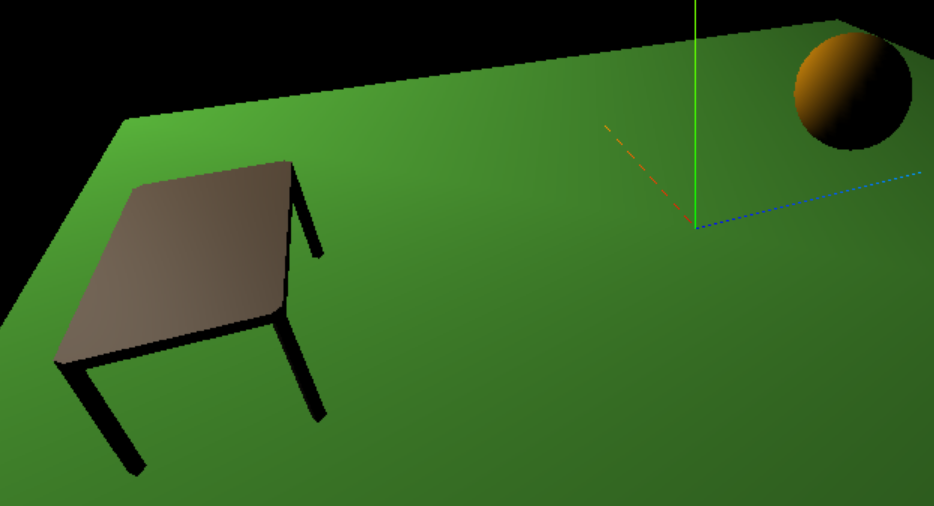

Je me suis alors confrontée à un problème, pour la détection des collisions il allait me falloir la position de ma table. J'ai donc souhaité récupérer mon obj dans un Mesh en m'inspirant de la méthode smooth du TP2, afin de pouvoir le manipuler.

Je crée donc une variable mesh dans la function(object) du .load de mon loader, que je crée à l'aide du matériel passé en paramètre de ma fonction d'import et de la géométie qui est un clone de celle de l'obj.

    var geometry = new THREE.Geometry().fromBufferGeometry(obj.geometry.clone());
    var mesh = new THREE.Mesh(geometry,material);

À la fin de ma fonction, je retourne la variable mesh et appel ma fonction comme suit pour la stocker le résultat.

    var table = import_obj('./Table_01.obj',2,scene,0,-7,0,-8,new THREE.MeshPhongMaterial({ color: "#a68868" }));

Lorsque je tente d'afficher la position de ma table dans la console à l'aide de ma variable mesh dans le loader tout ce passe bien.

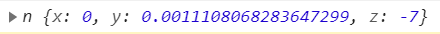

Mais quand je fais la même chose avec la variable table, cela ne se passe pas comme prévu. Ma variable n'est pas initialisée.

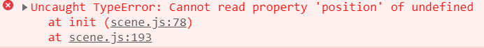

Je fais alors un deuxième essai, cette fois-ci en créant ma variable mesh non pas dans le .load du loader, mais avant, c'est alors la 1ere instruction de ma fonction import_obj() et le return est respectivement la dernière. Le résultat est cependant toujours le même.

Je tente alors un 3e essai, cette fois-ci en passant en paramètre à ma fonction d'import la variable table qu'elle doit utiliser pour créer le mesh, afin de contourner le return.

    var table;
    import_obj('./Table_01.obj',2,scene,0,-7,0,-8,new THREE.MeshPhongMaterial({ color: "#a68868" }),table);

Cependant, encore une fois c'est un echec, la même erreur appraraît. Cela vient sûrement du coté asynchrone de JavaScript, mais afin de ne pas perdre encore plus de temps là dessus je décide de créer tout simplement ma propre table directement avec des meshs.

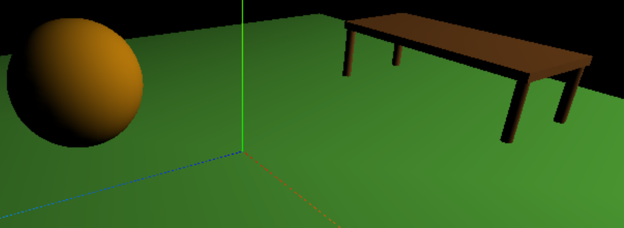

- Les cibles : 

Pour une mise en place plus simple de la détection de collision, j'ai fait le choix de prendre des cubes comme cibles. En effet, c'est une forme donc les faces sont lisses et les coordonnées de chacun des bords sont très simples à calculer.

J'ai souhaité d'abord placer mes cibles en forme de pyramide à 3 étages avec 6 objets, mais cela est assez compliquer, car cela implique de gérer la collision des cibles entre elles. En effet, si la balle frappe l'étage du bas, les cibles qui se trouvent plus haut doivent aussi être impactés. J'ai donc suivi les conseils de V et placé les objets simplement de manière alignée.

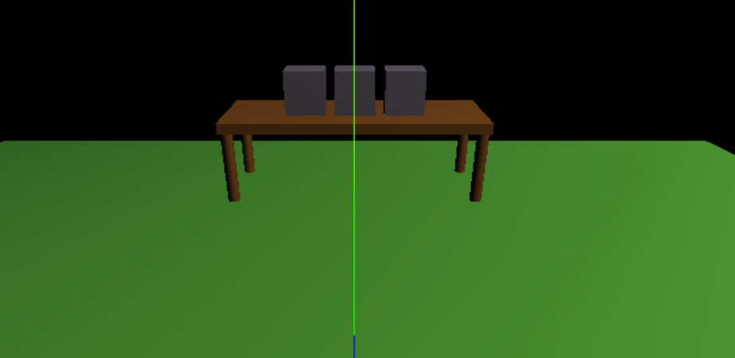

&nbsp;

**2) Récupérer la direction lors du clic dans la scène et voir si des objets sont sur le chemin** 

Afin de lancer ma balle, je choisis de me tourner vers un événement simple, le clic de souris. En me renseignant sur internet, je trouve [ce tuto](https://medium.com/whitestormjs-framework/developing-a-street-basketball-game-part-ll-throw-a-ball-into-a-basket-261f123d6e9c) qui fait quelque chose d'assez similaire puisqu'il s'agit d'un jeu de basket. Le tuto étant réalisé à l'aide du framework WhitestormJS, il propose différentes choses que je n'ai pas moyen d'utiliser. Néanmoins, je m'inspire de l'objet cursor qu'il utilise pour récupérer la direction du lancé. 

    cursor: {
        x: 0, // Mouse X.
        y: 0, // Mouse Y.
        xCenter: window.innerWidth / 2, // Window center X.
        yCenter: window.innerHeight / 2 // Window center Y.
    }

Je cherche alors dans les différents contrôleurs de ThreeJs s'il n'y a pas quelque chose d'assez semblable à utiliser. J'ai alors testé l'implémentation de PointerLockControls, cependant celui-ci n'est fait que pour suivre une caméra et pas un autre objet. Ensuite, j'ai voulu tester TransformControls qui permet de faire des translations sur les objets de la scène. Toutefois, après plusieurs essais je ne parvenais pas à le faire fonctionner. En faisant le point avec V il apparaît que ce contrôleur est difficile à implémenter et compliqué à utiliser.

Je me tourne alors vers le raycaster suite à ses recommandations. Je l'utilise alors avec sa méthode setFromCamera(). Celle-ci me permet de convertir la position de mon curseur en un rayon dans ma scène partant de ma caméra.

Je crée ainsi une fonction onMouseMove(event), qui récupère la position de mon curseur dès que celui-ci bouge. Les coordonnées x et y étant celles en 2D correspondant au plan de mon écran.

    function onMouseMove( event ){

        mouse.x = ( event.clientX / window.innerWidth ) * 2 - 1;
        mouse.y = - ( event.clientY / window.innerHeight ) * 2 + 1;
    }

Afin de voir les effets du rayon créé par le raycaster, j'utilise sa méthode intersectObjects(). Celle-ci prend en paramètre le tableau contenant les instances de mes différentes cibles. La fonction le parcourt et vérifie les coordonnées de chaque box afin de voir si elle rencontre le rayon.

    var intersects = raycaster.intersectObjects( boxes );

La variable intersects correspond alors à un tableau contenant les cibles qui sont en collision avec le rayon. Afin de rendre cela plus visuel, on parcourt ce tableau et change la couleur des cibles qui s'y trouvent.

    for ( var i = 0; i < intersects.length; i++ ) {
        intersects[i].object.material.color.set("#FF0000");
    }

Nos cibles deviennent ainsi rouges quand on les survole avec la souris.

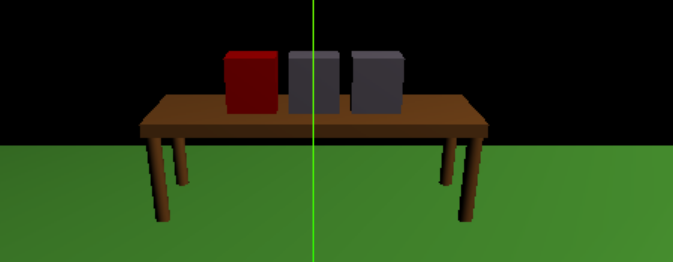

Cependant, on remarque une faille dans notre méthode de récupération des coordonnées de la souris. En effet, quand la fenêtre de la scène n'est pas affichée à 100% dans le navigateur, ou que la console est ouverte et prend une partie de l'écran, alors la position de la souris se trouve être décalée et on n'obtient pas le résultat attendu dans la scène pour le rayon.

Enfin, je modifie ma fonction onMouseMove(event), celle-ci est renommée par onClick et correspond à l'événement mousedown au lieu de mousemove. Ainsi, je récupère la position de la souris uniquement lors d'un clic et non au survol.

    window.addEventListener( 'mousedown', onClick, false );

&nbsp;

**3) Lancer la balle dans la direction du clic**

Je crée une variable clic qui est un simple booléen me permettant de savoir si ma balle doit être en mouvement ou statique à sa position initiale. Je la teste alors à chaque rechargement de page. Si elle est vraie alors j'effectue une simple translation sur l'axe z pour qu'elle avance en ligne droite. La translation est négative, car la table avec les cibles est placée dans les valeurs négatives. Pour qu'elle n'avance pas indéfiniment, je place une valeur d'arrêt à z=-6.

    ball.position.z -= 0.2;

Ensuite, j'applique la même méthode, mais à chacune des coordonnées de la balle afin de la faire avancer selon la direction du clic. Je crée donc un vecteur direction correspondant à la direction du rayon calculé par le raycaster.

    direction=raycaster.ray.direction;

Dans ma fonction throwBall() qui fait avancer ma balle, j'effectue à présent à chaque rafraîchissement de la page, une translation sur chaque axe selon mon vecteur direction.

    ball.position.z += direction.z;
    ball.position.y += direction.y;
    ball.position.x += direction.x;

Afin d'avoir un mouvement plus lent, je modifie ensuite ce bout de code pour diviser la composante donnée par le vecteur direction.

    ball.position.z += (direction.z/10);
    ball.position.y += (direction.y/10);
    ball.position.x += (direction.x/10);

On voit sur la capture d'écran ci-dessous, que la balle suit bien la direction du rayon, car elle se dirige vers les objets rencontrant le rayon du raycaster.

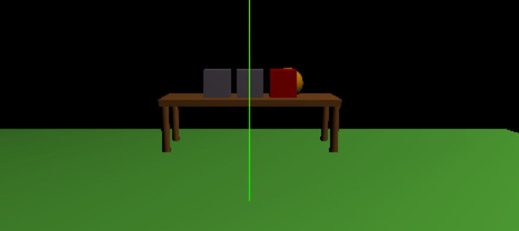

&nbsp;

**4) Lancer plusieurs fois la balle** 

Pour relancer plusieurs fois ma balle, je crée un vecteur posDepart contenant les coordonnées initiales de ma balle. Ainsi, là où je stoppais simplement les translations de cette dernière en passant clic à false quand elle passait à z=-6, maintenant je la replace à sa position de départ.

    if (ball.position.z < -6){
        clic = false;
        ball.position.set(posDepart.x, posDepart.y, posDepart.z);
    }

De plus, je teste dans ma fonction onClick si clic est déjà vrai. En effet, si le joueur reclic pendant que la balle est en mouvement, alors le raycaster va être à nouveau appelé et il va changer les valeurs de mon vecteur direction pour celles du nouveau clic. Cela va donc modifier la trajectoire de la balle. On ne récupère donc que les coordonnées de la souris lorsque clic est à false, autrement dit quand la balle est à sa position initiale.

Enfin, afin de ne pas m'embêter à transporter des moins dans mes coordonnées (les calculs de positifs sont plus digestes lors du débugage) pour mes translations ainsi que la détection de collision qui sera la partie suivante, j'ai modifié la position de tous les objets de ma scène pour que le mouvement de ma balle se fasse vers le côté positif des axes.

&nbsp;

**5) Gérer la collision entre la balle et les cibles**

La gestion de la collision entre ma balle et les cibles s'est faite en deux temps. En premier lieu, j'ai modifié simplement la couleur des cibles lors d'une collision, sans me soucier de l'impact de la balle. Puis, j'ai ajouté l'effet de cette collision en poussant mes cibles avec la balle quand elle les tape.

Pour le calcul de mes collisions, je me suis inspirée de [ce site](https://developer.mozilla.org/en-US/docs/Games/Techniques/3D_collision_detection) que je trouve particulièrement bien fait. Il explique les différentes formules mathématiques à l'aide de schéma et donne une équivalence en code JS. Ici, je suis donc le cas de la sphère et d'une box (Sphère vs AABB).

Je commence par placer mon code du raycaster directement dans la fonction onClick() tout en supprimant la partie intersectObjects(). À la place, je crée une fonction nommée collisionDetection() appelée par onClick() à chaque nouvelle translation de ma balle.

Cette fonction parcourt ma liste de cibles et cherche pour chacune d'elles le point qui se trouve être le plus proche de la balle. Puis elle calcule la distance entre ce point et le centre de ma balle. Si cette distance est inférieure au rayon de la balle, c'est alors que les deux objets sont entrés en collision.

    if (distance < ballRadius){
        collision(i);
    }

Je fais ainsi appel à une nouvelle méthode collision() qui prends en paramètre l'indice de ma box dans mon tableau de cibles. Pour cette première phase, je change simplement la couleur de la cible.

On peut voir que le changement de couleur s'effectue bien lors de la collision et pas avant comme avec le intersectObjects du raycaster. (Je n'ai pas réussi à prendre de capture d'écran au moment exacte de la collision mais on voit tout de même le changement)

| Avant la collision | Après la collision |
|:------------------:|:------------------:|
|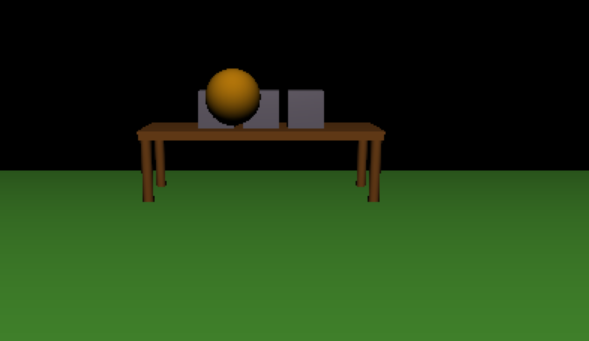|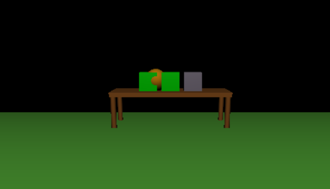|

Pour la deuxième phase, je modifie simplement le code de ma fonction collision(). En plus de modifier la couleur de ma cible, je lui applique la même translation que celle de ma balle.

    boxes[index].position.z += (direction.z/10);
    boxes[index].position.y += (direction.y/10);
    boxes[index].position.x += (direction.x/10);

Les cibles partent donc en arrière hors de la table selon la direction de la balle comme on peut le voir ci-dessous.

| Vue dessus | Vue arrière |
|:------------------:|:------------------:|
|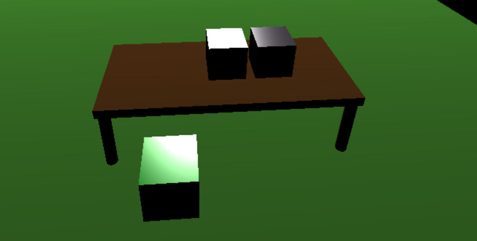|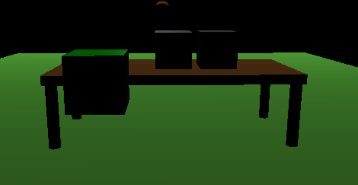|

&nbsp;

**6) Ajouter la gravité à notre scène**

Comme on le voit sur les images précédentes, nos cibles sont belles et biens poussées par la balle lors d'une collision, cependant elles ne tombent pas sur le sol mais flottent en l'air. Il est donc temps d'appliquer de la gravité à nos cibles mais aussi à la trajectoire de notre balle.

&nbsp;

- Version 1

Pour commencer facilement, je me suis servi d'un simple vecteur G pour la gravité afin d'ajouter sa composante lors des calculs de translation sans me soucier de la physique réelle.

    var G = new THREE.Vector3(0,-0.02,0);

Cette composante s'ajoute à la direction de ma balle lors du calcul de sa nouvelle position dans la fonction throwBall().

    ball.position.z += ((direction.z/10)+G.z);
    ball.position.y += ((direction.y/10)+G.y);
    ball.position.x += ((direction.x/10)+G.x);

Pour nos cibles, il est important de faire la distinction de si elles sont posées sur la table ou non. En effet, la gravité ne s'appliquera que dans le cas où elles sont hors de la table, sinon on gardera notre simple translation comme précédemment. Pour connaître cette information, on crée une nouvelle fonction boxOnTable renvoyant vrai si la cible dont on passe l'indice en paramètre est posée sur la table et faux sinon.

Pour simplifier et ne pas avoir à gérer les rotations des objets, on considère qu'une cible est hors de la table si elle n'a plus aucun contact avec elle. Même si dans les faits, une rotation pour la chute devrait avoir lieu environ à partir du moment où le milieu de la cible est hors de la table.

On calcule les coordonnées des bords de la table ainsi que les bords de notre box, puis on compare les bords entre eux pour savoir si la cible est encore sur le plateau de la table.

    if ( frontB > backT || backB < frontT || rightB < leftT || leftB > rightT ){
        return false;
    }
    return true;

Donc si la cible est encore posée, on la translate simplement sur les axes x et z selon la direction de la balle.

    if(onTable){
        boxes[index].position.z += (direction.z/10);
        boxes[index].position.x += (direction.x/10);
    }

Alors que si elle n'est plus dessus la gravité se rajoute. On ajoute un coefficient plus grand que pour la balle car les cibles vont tomber beaucoup plus vite au sol que la balle.

    else{
        boxes[index].position.z += ((direction.z/10)+5*G.z);
        boxes[index].position.y += ((direction.y/10)+5*G.y);
        boxes[index].position.x += ((direction.x/10)+5*G.x);
    }

Voici donc ce que l'on obtient à la suite de cette première implémentation simple de la gravité.

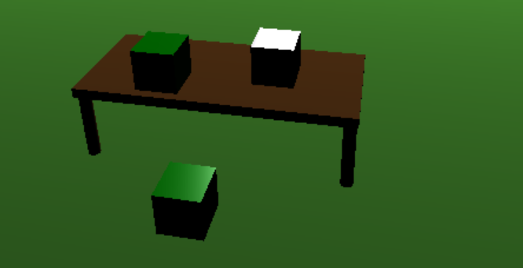

&nbsp;

- Version 2

Ensuite, je passe donc à une implémentation plus réaliste, cette fois en suivant les principes de la mécanique newtonnienne. Il me faut alors introduire une variable liée au temps nommée timeStep. Celle-ci provient de l'objet Clock de ThreeJs et permet à l'aide de sa méthode getDelta() de connaître le nombre de secondes écoulées depuis son dernier appel.

    var clock = new THREE.Clock(true);
    timeStep = clock.getDelta();

Je crée ensuite un vecteur accélération a, celui-ci aura la même utilité que le vecteur G de la version précédente, car on néglige les frottements. Ainsi, la somme des forces à laquelle sont soumis nos objets est uniquement constituée de la gravité. Cependant, pour avoir un mouvement plus lent, on ne prend pas directement la valeur -9,81 mais on la divise (ici par 40).

    var a = new THREE.Vector3(0,-0.255,0);

Il nous faut ensuite des vecteurs vitesses. Ceux des cibles sont stockés dans un tableau avec le même indice que le tableau contenant les instances des cibles. Leurs vecteurs initiaux sont tous nuls, car les cibles sont statiques sur la table.

    var v_boxes = [new THREE.Vector3(0,0,0),new THREE.Vector3(0,0,0),new THREE.Vector3(0,0,0)];

Pour notre balle c'est le vecteur direction qui nous servira de vecteur vitesse. Pour ralentir aussi le mouvement de la balle on multiplie ce vecteur par un facteur d'un demi.

    direction.multiplyScalar(0.5);

Ce facteur correspond donc à l'intensité de la vitesse tandis que les précédentes valeurs de direction correspondaient à la direction normalisée. J'ai eu du mal au début à gérer cela. En effet, j'avais créé deux vecteurs, un pour la direction normalisée et un pour l'intensité, mais je me suis mélangé entre les deux et je ne faisais que les calculs de variation sur l'intensité après quoi je multipliais par la direction normalisée. Ainsi, quand j'avais des composantes négatives dans les deux, l'effet s'annulait et ma balle partait dans le sens opposé à ce qui était voulu.

Ensuite, pour la gestion de la physique dans la scène, je crée une fonction physicUpdate() que j'appelle dans animate(). Dans cette dernière, on regarde si notre balle est lancée ou non. Si c'est le cas, alors on exécutera la fonction throwBall() qui gérera ensuite tout ce qui en découle. Sinon on applique la physique uniquement à nos cibles par le biais d'une autre nouvelle fonction physicBox() (que l'on présentera plus en détail après) à laquelle on passera une direction nulle.

Intéressons-nous au cas où notre balle est lancée. Dans notre fonction throwBall(), on calcule le nouveau vecteur vitesse de notre balle. Celui-ci correspond à sa valeur précédente, à laquelle on ajoute la variation de notre vecteur accélération en fonction du temps écoulé. On utilise la méthode clone() sur le vecteur accélération afin de ne pas modifier ses valeurs en mémoire.

    direction.add(a.clone().multiplyScalar(timeStep));

Une fois le nouveau vecteur vitesse obtenu, on met à jour le vecteur position de notre balle en effectuant une translation égale au vecteur vitesse.

    ball.position.add(direction);

Ensuite, on regarde si notre balle est encore dans la scène (zone couverte par le sol) et si elle est bien au-dessus du sol. Si ce n'est pas le cas, alors on replace notre balle à sa position initiale. Sinon on passe au traitement des collisions.

On appelle alors collisionDetection() qui fait le même travail que dans la version précédente. Cependant, le traitement final change. Si une cible est en collision avec la balle, on fait toujours appel à collision(), mais si elle ne l'est pas, on passe par la nouvelle fonction physicBox() mentionnée plus haut en lui donnant une direction nulle en paramètre.

Alors que fait cette fameuse fonction physicBox() ? Elle gère la physique de nos cibles et plus particulièrement leur chute. Elle commence par vérifier que la cible n'est pas sur la table ou sur le sol. Si oui, on calcule le nouveau vecteur vitesse de la box, de la même manière que celui de la balle.

    v_boxes[i].add(a.clone().multiplyScalar(timeStep));

Puis on regarde si une direction nous a été donnée en paramètre. Si c'est le cas, alors la balle est directement en collision avec cible actuellement et il faudra donc ajouter cette composante au calcul de notre vecteur vitesse.

    if (direc != null){
        var k_direction = direc.clone().multiplyScalar(0.3);
        v_boxes[i].add(k_direction);
    }

Si par contre on n'a pas de direction, alors la balle n'est plus en train de pousser la box, donc elle est simplement en chute libre.

Enfin, on calcule son nouveau vecteur position et on vérifie qu'elle ne traverse pas le sol, auquel cas on la replace simplement dessus.

    boxes[i].position.add(v_boxes[i]);
    if( (boxes[i].position.y - (boxes[i].geometry.parameters.height/2)) < 0 ){
        boxes[i].position.y = boxes[i].geometry.parameters.height/2;
    }

Dernier cas, celui de la collision en cours. Comme on l'a dit avant, si la balle rencontre une cible, elle fait appel à la fonction collision(). Le principe est exactement le même que celui de version précédente. Simplement, dans le cas où la cible se trouve sur la table la translation est maintenant effectuée comme suit à l'aide des vecteurs vitesse et position.

    var v = new THREE.Vector3(direction.clone().x, 0, direction.clone().z);
    boxes[index].position.add(v);

Tandis que si la balle n'est pas sur la table, on appelle physicBox() pour gérer sa chute en lui donnant la direction de la balle en paramètre.

Enfin, voilà le résultat obtenu après la chute d'une cible. On voit qu'elle tombe beaucoup plus loin de par la direction que lui donne la balle dans sa chute.

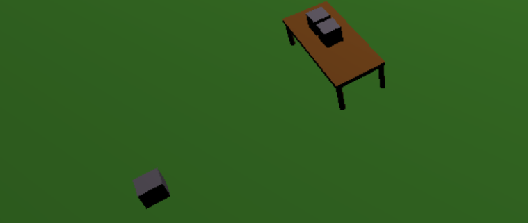

&nbsp;

**7) Gérer la collision entre la balle et la table**

À ce stade, on gère donc bien la collision de notre balle avec les cibles, mais elle passe encore au travers de la table. Pour pallier à ce problème, on va mettre deux choses en place. Premièrement, si la balle tape contre un pied de la table, alors le tir ne peut pas aboutir et la balle revient à sa position initiale. De même, si elle frappe la planche de la table sur le côté, elle va techniquement rebondir en arrière et n'atteindra pas les cibles, donc retour à sa position initiale. Deuxièmement, si la balle touche la table par le haut, alors elle doit rouler dessus.

Dans un premier temps, on s'occupe de gérer les pieds de la table. On place leurs instances dans un tableau global afin de pouvoir accéder à leurs informations géométriques. Afin de réutiliser le code de collisionDetection(), on change nos pieds auparavant cylindryques pour des BoxGeometry.

Pour pouvoir utiliser collisionDetection() avec les autres objets, on sort la boucle de parcours du tableau des cibles pour la donner à throwBall(). Notre fonction prend donc maintenant un élément en paramètre et renvoie juste la distance, ce n'est plus elle qui gère les appels aux fonctions collision() et physicBox().

On regarde donc dans throwBall(), si la balle est en collision avec les pieds de table, au même endroit où l'on teste si elle sort de la scène.

Ensuite, il nous faut gérer la planche de la table. Pour cela, on met en place un vecteur stockant l'ancienne position de notre balle.

    b_prec_pos = ball.position.clone();

En effet, lors d'une collision avec la planche de la table, si le point le plus bas de la balle était plus haut que la planche sur l'axe y à la position précédente, c'est qu'elle arrive par le haut donc on la replace sur la table, sinon elle tape sur les côtés.

    if( (ball.position.y - ballRadius < table.position.y + (table.geometry.parameters.height/2)) &&  (b_prec_pos.y - ballRadius >= table.position.y + (table.geometry.parameters.height/2)) ){
        ball.position.y = (table.position.y + (table.geometry.parameters.height/2)) + ballRadius;
    }

Voici enfin une illustration de la balle qui roule sur la table quand elle arrive par le haut.

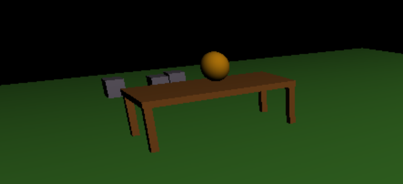

&nbsp;

### III) Améliorations futures

Ce projet mériterait encore de nombreuses améliorations, mais dont le temps nécessaire ne me le permettait pas vraiment ici.

La principale amélioration selon moi, serait d'ajouter la rotation des objets. Cela impacterait la direction dans laquelle partent nos cibles quand la balle les touche en fonction de l'angle de collision. De plus, on pourrait aussi avoir des chutes plus réalistes et qui n'attendent pas que l'objet soit 100% en dehors de la table pour se déclencher.

Il serait aussi intérressant de pouvoir gérer des cibles avec une autre disposition que celle en ligne assez simpliste. Notamment la disposition en pyramide qui est celle de base d'un chamboule tout. De même, la forme des cibles pourrait être modifiée, soit par des cylindre pour simuler la forme de base ou bien par autre chose de plus fantaisiste qui nécessiterait une gestion accrue des collisions.

Enfin, on pourrait améliorer aussi ajouter encore des petites choses comme le rebond de la balle ou bien tenir compte des frottements de l'air.
